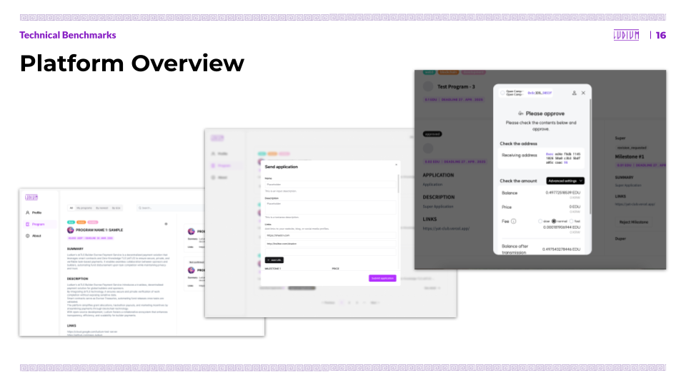
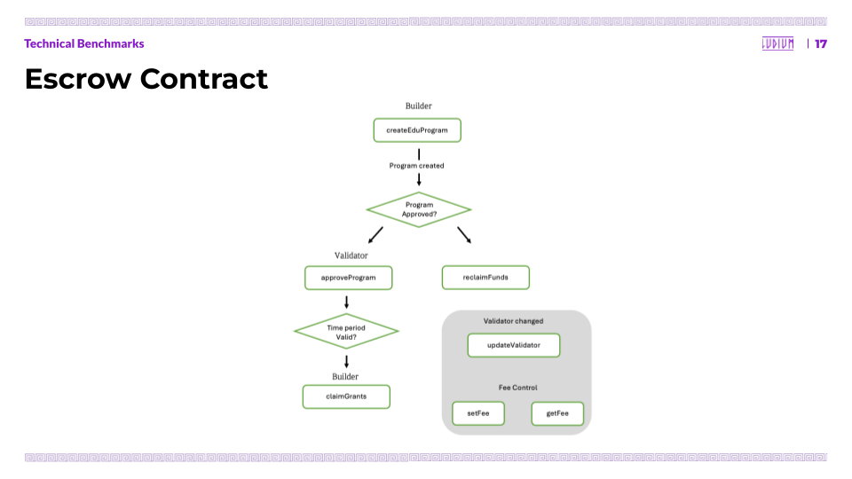
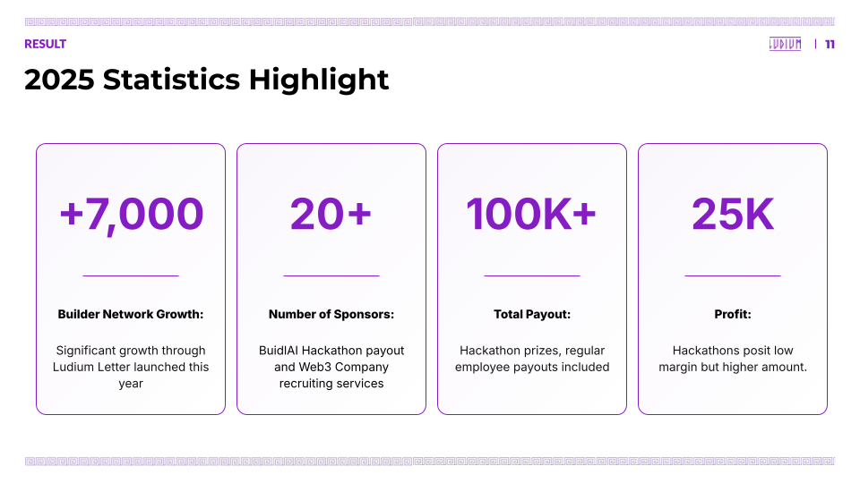
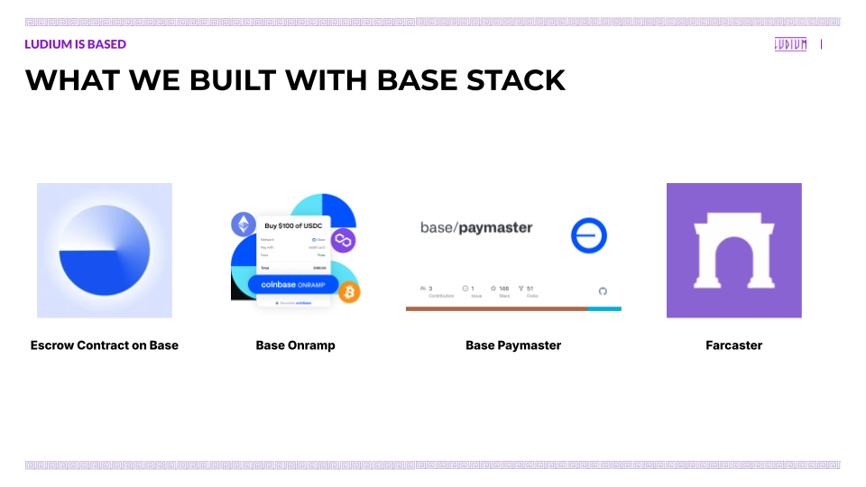
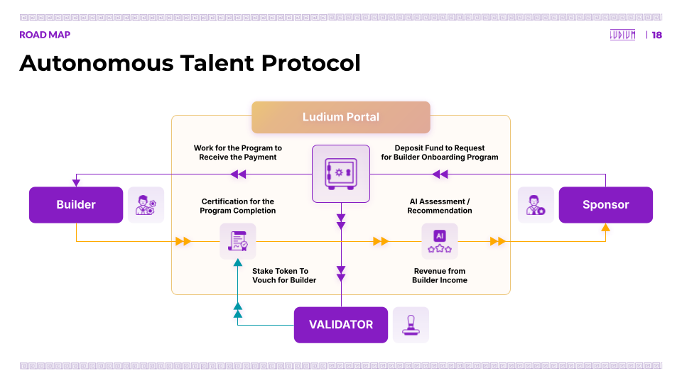

# Ludium: WEB3 TALENT PLATFORM

## Overview

The digital native world opens new doors for the great opportunity for talents. For one, it is **geographically agnostic**. Two, it allows **asynchronous** project management. And finally, it promotes **pluralistic contribution**. However, we are still bounded to work in a place at the designated time for one organization.

Ludium believes that the new world begs for a new system. For this, we develop a system that is **accessible, collaborative and trustless** for the liberty of the builders.

## Problem

## Solutions

## Market Adoption

## Ludium is BASED

- Why Base?
    - Technical Onboarding
    - Social / User on Base
- Technical Stacks Used
    - Escrow Contract
    - Onramp
    - Paymaster
    - Escrow Contract

## Roadmap

