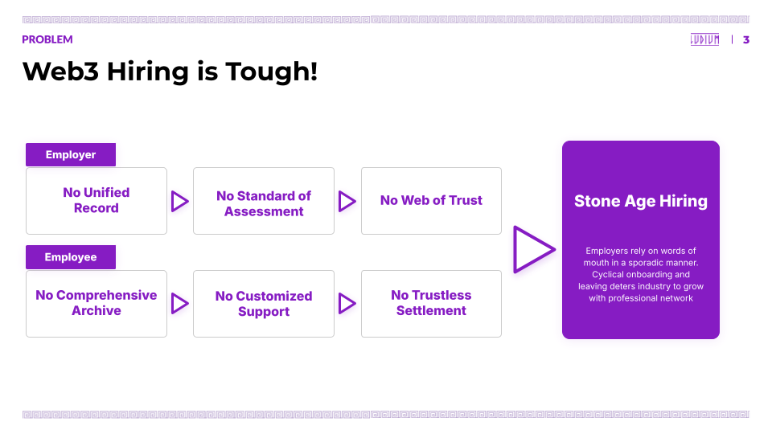

# Ludium: WEB3 TALENT PLATFORM

## Overview

The digital native world opens new doors for the great opportunity for talents. For one, it is **geographically agnostic**. Two, it allows **asynchronous** project management. And finally, it promotes **pluralistic contribution**. However, we are still bounded to work in a place at the designated time for one organization.

Ludium believes that the new world begs for a new system. For this, we develop a system that is **accessible, collaborative and trustless** for the liberty of the builders.

## Problem

## Solution - Talent Matching Platform

Ludium provides a talent matching platform for builders to 

- **Manage Profiles**: Share social, professional, and project acheivement to prove the builder's status
- **Join Programs**: Apply for programs that provide builder opportunity and receive payment based on the success of milestones
- **Join Community**: Post information and join projects to form a new team 

.png)

Under the hood, program triggers onchain escrow contract that
- **Takes Deposit**: Sponsors deposit the amount to be distributed to the builders 
- **Aceept Milestones**: Builders submit milestone to prove the completion of work
- **Settle Payment** Deposited amount is paid to the builders based on the agreed milestones

## Ludium is BASED
.png)

For Base Bathch, Ludium integrated four different technical stacks from Base Ecosystem:

- **Why Base?**
    - Technical Onboarding: Coinbase Developer Platform(CDP) and other eocsystem projects offer quality SDKs/APIs that enhance convenience and reach out
    - Social / User on Base: Base Network is full of users onchain especially on farcaster that fits the builder / sponsor 
- **Technical Stacks Used**
    - Escrow Contract: Deployed escrow contract in Solidity to BASE Sepolia Testnet. Anyone can deposit amount in $ETH / $USDT / $USDC on BASE to launch a program
    - Onchain Kit: Utilized Coinbase Onchain Kit for social login / KYC. It increase the ease of onboarding especially for the new builders
    - Paymaster: Used paymaster to delegate fees to set up programs. It lowers the barrier of entrance to set up programs 
    - Farcaster: Included a button to post frame on Warpcast to share programs. It will increase the expsoure and to related crowd on Base Network such as [bountey caster](https://www.bountycaster.xyz/)   

## Market Adoption - Statistics Highlights
.png)
During the first Quater of 2025, Ludium witnessed a significant growth in
- **Number of Users**: We launched a new builder community letter with significant grwoth in subscribers
- **Number of Spnosors**: Sponsors joined hackathons, incuation, and other programs
- **Revenue / Profit**: Ludium takes 30% on average out of the sponsored amount

.png)

Before the end of the year, we expect
- **Number of Users**: All users to onboard to the platform and activities are counted onchain
- **Number of Sponsors**: Not only Web3 Foundations but also other corporations and organizations to join in
- **Revenue / Profit**: Significant growth in revenue as largers deals are under discussion

## Roadmap - Trustless Agent Matching Protocol
.png)

Ludium believe that the digitalized talent sourcing will gradually substitute the conventional HR industry. For this, we believe that 1) **Adoption of the Agents** 2) **Verifiable Onchain Credentials** 3) **Trustless Contribution Settlement** are the keys to scalable protocol. To that end, we bring TAMP(Trustless Agent Matching Protocol) that is both automated and decentrzlied way of finding the right agent 

.png)

As we move toward more agentic future, Ludium plans to adopt following stacks from CDP

- Base Onramp: For the ease of payment, Fiat Onramp is crucial. Base On Ramp offers smooth payment experience. Once Ludium is deployed on Base Mainnet, it is possible to adopt the stack
- Talent Protocol: For onchain credential on builder profiles, Ludium need to analyze various sources of skill data. Talent protocol provides builder score that can serve as a source of reference  
- AgentKit: Agentic future requires coordination and orchestration of multiple agents each performing it's task both onchain and offchain. For this, Coinbase Onchain Kit can be a go to resource for the Based Future