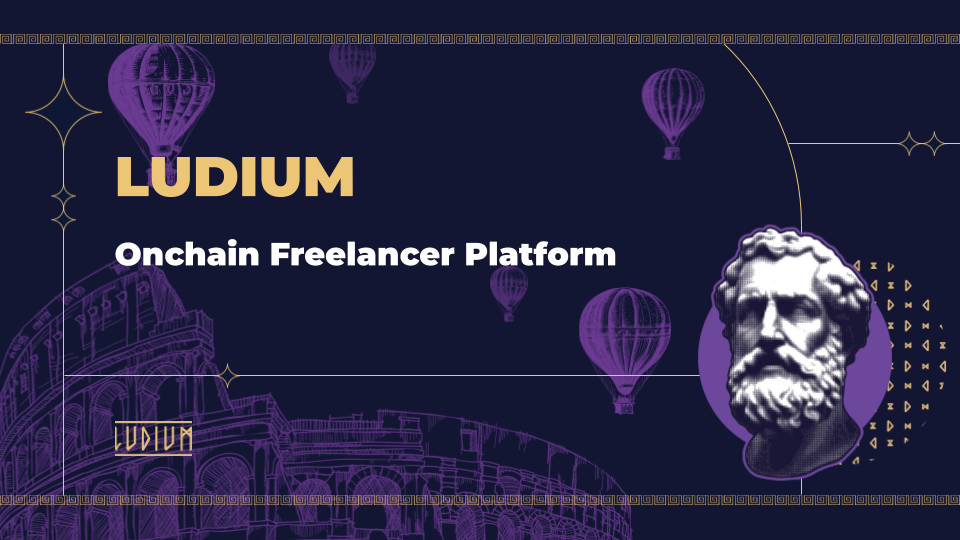
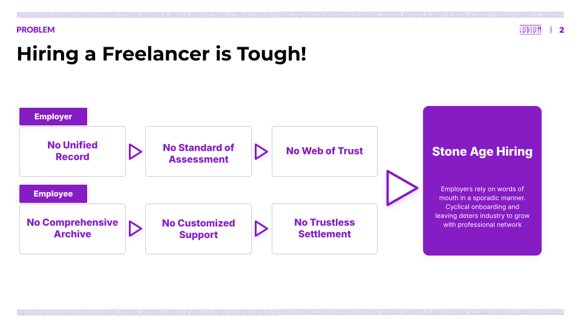
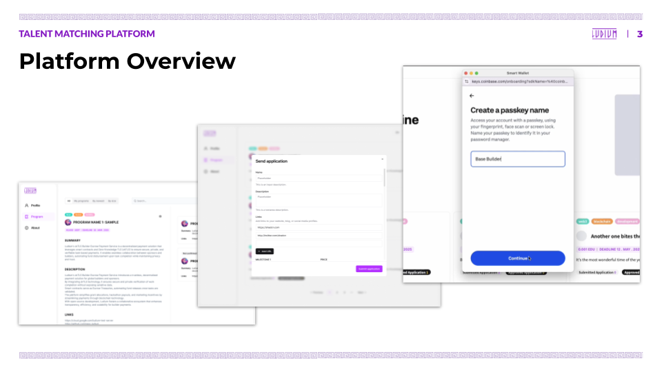
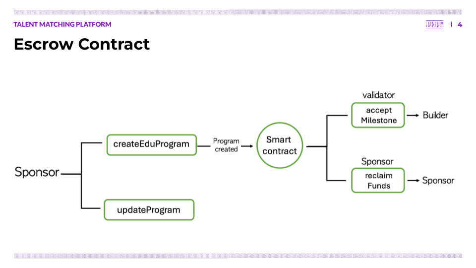
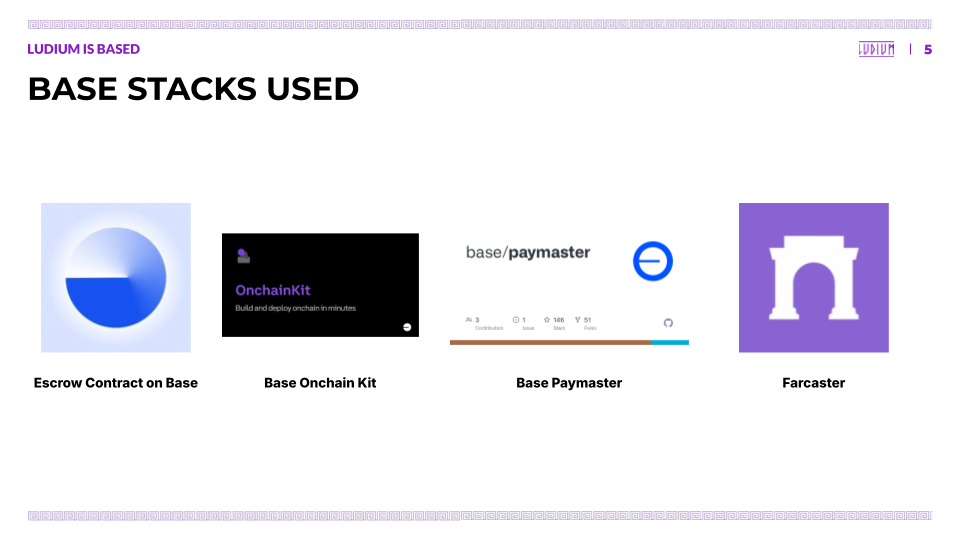
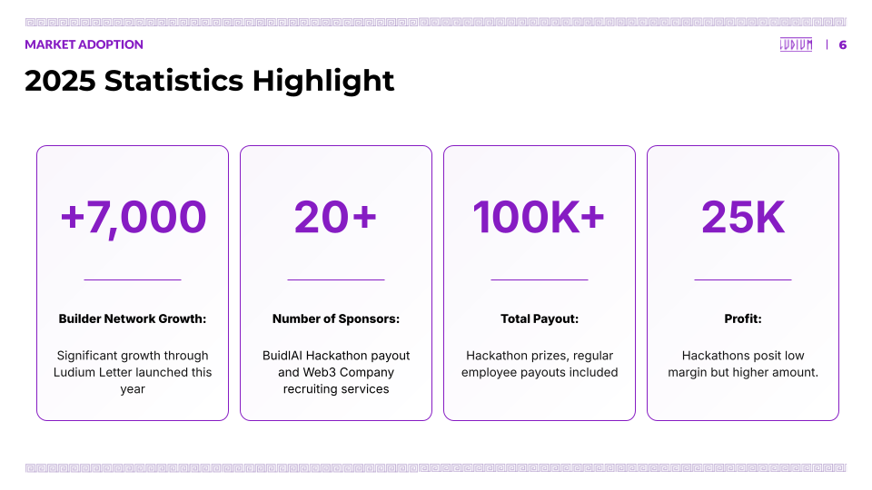
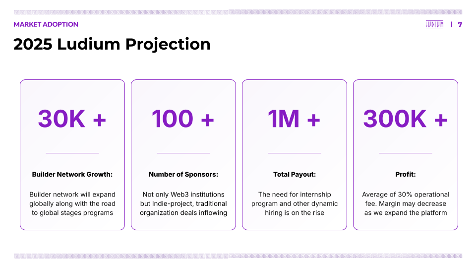
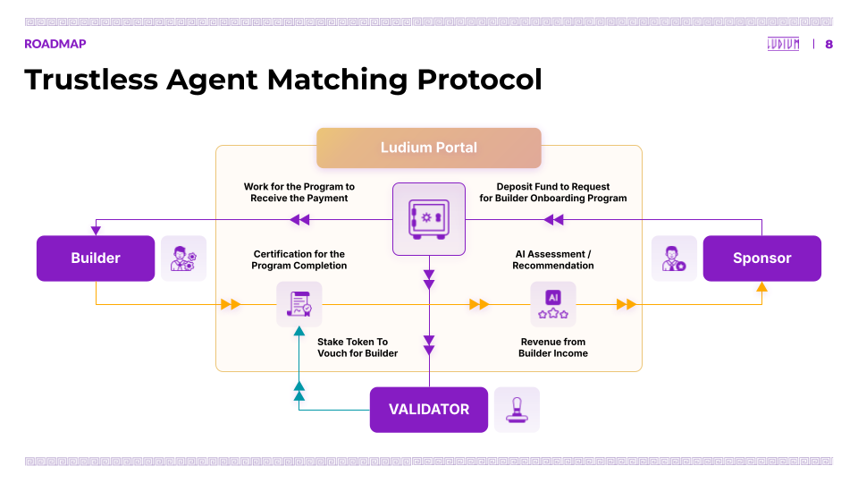
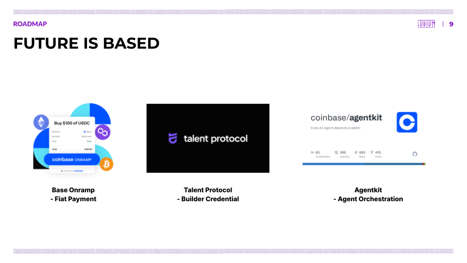

# 🏛️ Ludium: Onchain Freelancer Platform

## 🌍 Overview

The digital native world opens new doors for the great opportunity for freelancers. For one, it is **geographically agnostic**. Two, it allows **asynchronous** project management. And finally, it promotes **pluralistic contribution**. We imagine a world where we are free to **work from anywhere at anytime with anyone** and **enjoy the highest compensation** based on contributions.

To enter the new world, we demand a new system. The system that allows **faster, cheaper, and more reliable** freelancers to congregate. We believe that the system must incorporate the **liquidity of builder capital based on task performances**. For this, we develop **accessible, collaborative and trustless** freelancer platform for the liberty of the builders.

## ❗ Problem - No Country For Freelancers

The traditional talent-matching system is centralized. In such systems, **it’s difficult to fully reflect what skills someone has or what projects they’ve contributed to**, with resumes and interviews being the main — and often limited — tools for assessment. This information remains fragmented across isolated data silos.

This structure is particularly inadequate for Web3, where **decentralized communities and autonomous contributions are the norm**. Additionally, freelancers and project-based agents currently lack clear standards for establishing trust and maintaining long-term collaboration. While anyone can apply to contribute to a project, **there’s no standardized framework for identifying who is trustworthy, how contributions should be evaluated, or how rewards should be distributed**. As a result, we often see contributors not getting paid or requesters disappearing without results. **An automated system of trust and settlement is urgently needed.**

## ✅ Solution - Trustless Talent Matching Platform

To solve these problems, Ludium proposes an onchain-based talent matching platform. Builders can **create a profile based on their skills and experience**, and **build trust through verifiable onchain credentials**, such as past project settlements or milestone completions. These profiles go beyond resumes — they are **performance-based assets tied to individual projects**.

**Sponsors** can create programs by depositing budgets into escrow and setting conditions (e.g., minimum voucher amounts, validator staking, etc.). **Builders** apply and **submit milestones upon task completion**. **Validators** review and approve the work. The entire flow is automated via smart contracts — **when deliverables are submitted and approved, payments are released automatically; if tasks fail, penalties and slashing mechanisms refund part of the deposit to the sponsor**.

This system is **optimized for project-based collaboration** and replaces trust with a **dual mechanism: contract terms + validator reputation**. It enables fair and transparent participation, with each contributor’s performance permanently recorded onchain for future opportunities.

## 💙 Ludium is BAsed - Stack Integration

Base provides **fast transaction speeds, low fees, and developer-friendly infrastructure** — ideal for real-world Web3 platforms.

- **Escrow Smart Contracts**: Built on Solidity and deployed on **Base Sepolia Testnet**, program budgets are securely held in escrow. For example, if a sponsor deposits 100 USDC and a builder completes a milestone, the funds are released automatically. If the task fails, slashing mechanisms return part of the funds to the sponsor.
- **Onchain Kit (by Coinbase)**: Users can onboard using **social login and KYC** features provided by Coinbase Onchain Kit. It makes it easier for anyone to set up a new account and start using the platform.
- **Paymaster Functionality**: The biggest barrier for new users is gas fees. Ludium lowers that barrier by **covering gas fees** for sponsors and validators through Paymaster integration.
- **Farcaster Integration (Warpcast Frame)**: Programs can be shared on the Farcaster network through an **embedded Frame button**. This enables organic spread within niche Web3 communities like bounty casters.

Base isn’t just a technical choice — **it’s the foundation for a frictionless and equitable Web3 talent marketplace** where anyone can easily participate and be fairly rewarded.

## 📊 Market Adoption - 2025 Highlight

Ludium has seen significant growth in Q1 2025.

- **User Growth**: Newsletter subscribers have rapidly increased, and the weekly letter sharing open positions and collaborative projects has become a key gateway for builders.
- **Sponsor Acquisition**: More institutions are setting up programs through Ludium, including hackathons, incubation programs, and research bounties — not just Web3 foundations but also startups and enterprises running pilot programs.
- **Revenue Growth**: Ludium charges an average 30% operational fee based on escrow settlements. This is more sustainable than one-off fees since it is tied to actual performance. Some programs have already processed funds in the millions of KRW per engagement.

## 📈 Projection - 2025 Outlook

- By the end of 2025, Ludium is focused on **enhancing visibility of performance through automated onchain activity and user conversion**. Contribution history, settlement outcomes, and feedback are all recorded onchain, turning in-platform activity into real career value.
- On the sponsor side, there’s a shift from short-term tasks to **long-term contracts** (e.g., quarterly talent matching, recurring partner programs). Current discussions include global NGOs, public sector collaborations, and venture funds — with budgets potentially reaching tens of millions of KRW per program.
- Overall, 2025 is expected to be the year when **“performance-based liquidity” built on “technology-based trust” truly activates** — and Ludium aims to be a central player in that transformation.
  
## 🛣️ Roadmap - TAMP (Trustless Agent Matching Protocol)

To expand into a full-scale Web3 HR infrastructure, Ludium is developing **TAMP (Trustless Agent Matching Protocol)** — a protocol that enables automated matching and settlements based on onchain identity and performance.

TAMP is built on three pillars:

- **Agent Workstation**: Builders, validators, and sponsors can be either humans or AI with various roles and skills. Each agent takes on tasks and submits results.
- **Verifiable Onchain Credentials (VOC)**: Unlike traditional resumes, credentials are based on actual project contributions and onchain settlement results.
- **Trustless Settlement**: Smart contracts distribute rewards based on contribution and validation. Penalties and slashing apply for failed tasks.

TAMP is ideally suited for the fast-growing Web3 use cases like DAOs, contributor-driven hackathons, and decentralized research networks. Ludium’s aim is to establish TAMP as the **standard for turning task-based labor into digital assets**.

## 🔮 Roadmap - Future is Based

Ludium is prepared to grow alongside the evolving Base ecosystem. Among Base’s many technical infrastructures, the following three are key to Ludium’s strategic future:

1. **Base Onramp**: Fiat-to-crypto onramps simplify onboarding for non-Web3 users — especially enterprise sponsors — who can participate without handling crypto directly.
2. **Talent Protocol**: Ludium plans to introduce onchain reputation scores (Talent Score) to builder profiles. By integrating Talent Protocol APIs, we can visualize and automate performance indicators, allowing builders to prove their value through "project-based assets."
3. **AgentKit**: To manage the distributed nature of agents (on/off-chain), Ludium will adopt Coinbase's AgentKit, enabling automated coordination between builders, validators, and sponsors while optimizing complex workflows via code.

Ultimately, Ludium is not just a hiring platform — it is building a **"contribution-based trust ecosystem"** where every agent in Web3 can monetize their skills and earn fair compensation. **And at the center of that vision is Base.**

## 📚 References

- [**Base Batch - Project Demo Video**](https://youtu.be/zoKU4cswnQg)
- [**Base Batch - Framer Source Code**](https://github.com/Ludium-Official/ludium-farcaster)
- [**Base Batch - Escrow Contract Address**](https://base-sepolia.blockscout.com/address/0xAe740E9D85d0D177DFbeC0666E65Eb721087c5bc?tab=index)
- [**Ludium Portal - Live Website**](https://www.ludium.world/)
- [**Ludium Portal - Github Source Code Archive**](https://github.com/Ludium-Official/ludium-portal)
- [**Ludium Portal - Escrow Contract Source Code**](https://github.com/Ludium-Official/ludium-portal-contract)